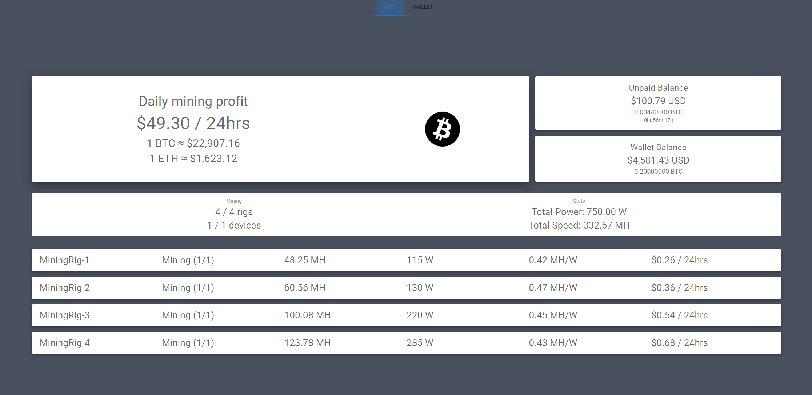

# nh-dashboard
A simple NiceHash dashboard that displays:

## Demo
https://nh-dashboard-d4tym.ondigitalocean.app/demo
<br/><br/>


<br/><br/>
**Overview**
- Daily mining profits
- BTC and ETH current price
- Unpaid balance
- Wallet Balance

**Rig Stats**
- #&#x2060; of rigs online
- #&#x2060; of devices online
- total power usage (GPU only; does not include system power)
- total speed

**Rigs**
- rig total speed
- rig total power
- rig efficiency
- rig profit
- individual device temp
- individual device vram temp
- individual device speed
- individual device fan speed
- individual device power
- individual device efficiency

<br/>
Built with React.js and Express.js using NiceHash API.
<br/>


### Getting Started

First step is to adjust the filename for the .env-example file and change it to .env 

Next step is to go to NiceHash Dashboard settings in your computer and get the API information. Add that to the .env file

Next, install the dependencies with npm i
```bash
npm i
```

### Running The App in Development

To run the app, run:
```bash
npm run dev
```

### Running The App in Prod

To run the app, run:
```bash
npm run start
```

### Digital Ocean
I currently use digital ocean to host the app.
Cost $5 a month to run on basic plan. 
Here are the steps to get it set up:

1. Make sure you have forked this repository on GitHub
2. Create a DigitalOcean account if you dont have one
3. Click the green Create button at the top right of the screen; Click Apps 
4. Select GitHub as service provider; select the repository; click next
5. Click edit plan, select the plan size (I use basic - $5 a month)
6. Select Create Resources
7. It should deploy with your most recent commmit to main
8. make sure to set the environment variables within your settings
I have the settings set so that it auto deploys when a commit is made to main


## Donations:
BTC: bc1q7e2rtx7ktrl27wt97avk42994v8ve8ctjk6kzm


